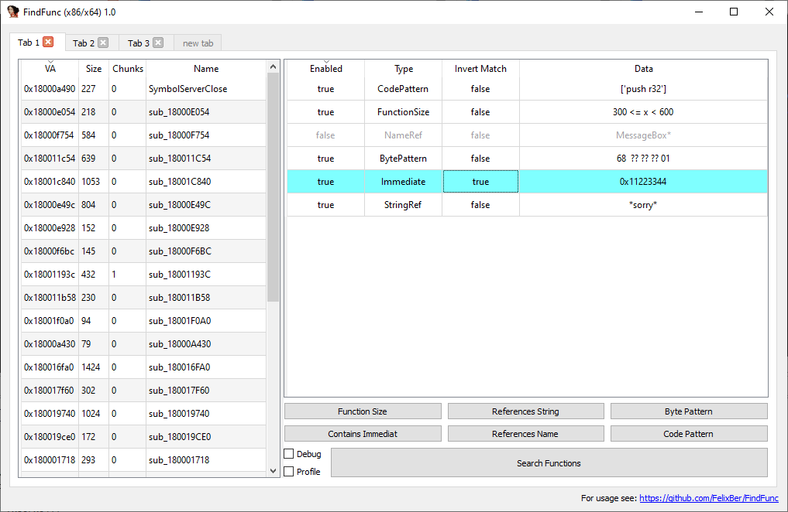

# FindFunc: Advanced Filtering/Finding of Functions in IDA Pro

FindFunc is an IDA Pro plugin to find code functions that contain a certain assembly or byte pattern, reference a certain name or string, or conform to various other constraints. This is not a competitor to tools like Diaphora or BinNavi, but it is ideal to find a known function in a new binary for cases where classical bindiffing fails.

## Filtering with Rules

The main functionality of FindFunc is letting the user specify a set of "Rules" or constraints that a code function in IDA Pro has to satisfy. FF will then find and list all functions that satisfy ALL rules (so currently all Rules are in an AND-conjunction). Exception: Rules can be "inverted" to be negative matches. Such rules thus conform to "AND NOT".

FF will schedule the rules in a smart order to minimize processing time.
Feature overview:

* Currently 6 Rules available, see below
* Code matching respects Addressing-Size-Prefix and Operand-Size-Prefix
* Aware of function chunks
* Smart scheduling of rules for performance
* Saving/Loading rules from/to file in simple ascii format
* Several independent Tabs for experimentation
* Copying rules between Tabs via clipboard (same format as file format)
* Advanced copying of instruction bytes (all, opcodes only, all except immediates)

Button "Search Functions" clears existing results and starts a fresh search,
"Refine Results" considers only results of the previous search.

### Advanced Binary Copying

A secondary feature of FF is the option to copy binary representation of instructions with the following options:

* copy all -> copy all bytes to the clipboard
* copy without immediates -> blank out (AA ?? BB) any immediate values in the instruction bytes
* opcode only -> will blank out everything except the actual opcode(s) of the instruction (and prefixes)

See "advanced copying" section below for details.
This feature nicely complements the Byte Pattern rule!

## Building and Installation

FindFunc is an IDA Pro python plugin without external package dependencies.
It can be installed by downloading the repository and copying file findfuncmain.py and folder findfunc to your IDA Pro plugin directory. No building is required.

Requirements: IDA Pro 7.x (7.6+) with python3 environment.
FindFunc is designed for x86/x64 architecture only.
It has been tested with IDA 7.6/7.7, python 3.9 and IDAPython 7.4.0 on Windows 10.

# Available Rules

Currently the following six rules are available. They are sorted here from heavy to light with regard to performance impact.
With large databases it is a good idea to first cut down the candidate-functions with a cheap rule, before doing heavy matching via e.g. Code Rules. FF will automatically schedule rules in a smart way.

### Code Pattern

Rule for filtering function based on them containing a given assembly code snippet.
This is NOT a text-search for IDAs textual disassembly representation, but rather performs advanced matching of the underlying instruction.
The snippet may contain many consecutive instructions, one per line. Function chunks are supported.
Supports special wildcard matching, in addition to literal assembly:

* "pass" -> matches any instruction with any operands
* "mov* any,any" -> matches instructions with mnemonic "mov*" (e.g. mov, movzx, ...)
                    and any two arguments.
* "mov eax, r32" -> matches any instruction with mnemonic "mov", first operand register eax and second operand any 32-bit register.
    * Analogue: r for any register, r8/r16/r32/r64 for register of a specific width, "imm" for any immediate
* "mov r64, imm" -> matches any move of a constant to a 64bit register
* "any r64,r64" -> matches any operation between two 64bit registers
* mov -> matches any instruction of mov mnemonic

more examples:

    mov r64, [r32 * 8 + 0x100]
    mov r, [r * 8 - 0x100]
    mov r64, [r32 * 8 + imm]
    pass
    mov r, word [eax + r32 * 8 - 0x100]
    any r64, r64
    push imm
    push any

**Gotchas:** Be careful when copying over assembly from IDA.
IDA mingles local variable names and other information into the instruction which leads to matching failure.
Also, labels are not supported ("call sub_123456").

Note that Code Patterns is the most expensive Rule, and if only Code Rules are present FF has no option but to disassemble the entire database. This can take up to several minutes for very large binaries. See notes on performance below.

### Immediate Value (Constant)

The function must contain the given immediate at least once in any position.
An immediate value is a value fixed in the binary representation of the instruction.
Examples for instructions matching immediate value 0x100:

    mov eax, 0x100
    mov eax, [0x100]
    and al, [eax + ebx*8 + 0x100]
    push 0x100

Note: IDA performs extensive matching of any size and any position of the immediate. If you know it to be of a specific width of 4 or 8 bytes, a byte pattern can be a little faster.

### Byte Pattern

The function must contain the given byte pattern at least once.
The pattern is of the same format as IDAs binary search, and thus supports wildcards - the perfect match for the advanced-copy feature!

Examples:

    11 22 33 44 aa bb cc
    11 22 33 ?? ?? bb cc -> ?? can be any byte

Note: Pattern matching is quiet fast and a good candidate to cut down matches quickly!

### String Reference

The function must reference the given string at least once.
The string is matched according to pythons 'fnmatch' module, and thus supports wildcard-like matching.
Matching is performed case-insensitive.
Strings of the following formats are considered: [idaapi.STRTYPE_C, idaapi.STRTYPE_C_16] (this can be changed in the Config class).

Examples:

* "TestString" -> function must reference the exact string (casing ignored) at least once
* "TestStr*" -> function must reference a string starting with 'TestStr (e.g. TestString, TestStrong) at least once (casing ignored)

Note: String matching is fast and a good choice to cut down candidates quickly!

### Name Reference

The function must reference the given name/label at least once.
The name/label is matched according to pythons 'fnmatch' module, and thus supports wildcard-like matching.
Matching is performed case-insensitive.

Examples:

* "memset" -> function must reference a location named "memset" at least once
* "mem*" -> function must reference a location starting with "mem" (memset, memcpy, memcmp) at least once

Note: Name matching is very fast and ideal to cut down candidates quickly!

### Function Size

The size of the function must be within the given limit: "min <= functionsize <= max".
Data is entered as a string of the form "min,max".
The size of a function includes all of its chunks.

Note: Function size matching is very fast and ideal to cut down candidates quickly!

## Keyboard Shortcuts & GUI

For ease of use FF can be used via the following keyboard shortcuts:

* Ctrl+Alt+F -> launch/show TabWidget (main GUI)
* Ctrl+F -> start search with currently enabled rules
* Ctrl+R -> refine existing results with currently enabled rules
* Ctrl+C -> copy selected rules to clipboard
* Ctrl+V -> paste rules from clipboard into current tab (appends)
* Ctrl+S -> save selected rules to file
* Ctrl+L -> load selected rules from file (appends)
* Ctrl+A -> select all rules
* Del -> delete selected rules

Further GUI usage

* Rules can be edited by double-clicking the Data column
* Rules can be inverted (negative match) by double-clicking the invert-match column
* Rules can be enabled/disabled by double-clicking the enabled-column
* Tabs can be renamed by double-clicking them
* Sorting is supported both for Rule-List and Result-List
* Double-click Result item to jump to it in IDA
  * function name: jump to function start
  * any other column: jump to match of last matched rule
* Checkbox Profile: Outputs profiling information for the search
* Checkbox Debug: Dumps detailed debugging output for code rule matching - only use it if few functions make it to the code checking rule, otherwise it might take very long!

## Advanced Binary Copy

Frequently we want to search for binary patterns of assembly, but without hardcoded  addresses and values (immediates),
or even only the actual opcodes of the instruction. FindFunc makes this easy by adding three copy options to the disassembly-popupmenu:

### Copy all bytes

Copies all instruction bytes as hex-string to clipboard, for use in a Byte-Pattern-Rule (or IDAs binary search).

    B8 44332211      mov eax,11223344
    68 00000001      push 1000000
    66:894424 70     mov word ptr ss:[esp+70],ax

will be copied as

    b8 44 33 22 11 68 00 00 00 01 66 89 44 24 70

### Copy only non-immediate bytes

Copies instruction bytes for given instruction, masking out any immediate values.
Example:

    B8 44332211      mov eax,11223344
    68 00000001      push 1000000
    66:894424 70     mov word ptr ss:[esp+70],ax

will be copied as

    b8 ?? ?? ?? ?? 68 ?? ?? ?? ?? 66 89 44 24 ??
    

### Copy only opcodes

Copy all instruction bytes as hex-string to clipboard, masking out any bytes that are not the actual opcode (including sib, modrm, but keeping legacy prefixes).

    B8 44332211      mov eax,11223344
    68 00000001      push 1000000
    66:894424 70     mov word ptr ss:[esp+70],ax

will be copied as

    b8 ?? ?? ?? ?? 68 ?? ?? ?? ?? 66 89 ?? ?? ??

Note: This is a "best effort" using IDAs API, thus there may be few cases where it only works partially.
For a 100% correct solution we would have to ship a dedicated x86 disasm library.

Similar results can be achieved with Code Pattern Rules, but this might be faster,
both for user interaction and the actual search.

### Copy disasm

Copies selected disassembly to clipboard, as it appears in IDA.

## Performance

A brief word on performance:

1. name, string, funcsize are almost free in all cases
2. bytepattern is almost free for patterns length > 2
3. immediate is difficult:
    We can use idaapi search, or we can disassemble the entire database and search ourselves - we may have to do this anyways if we are looking for code patterns.
    BUT: scanning for code patterns is in fact much cheaper than scanning for an immediate.
    An api-search for all matches is relatively costly - about 1/8 as costly as disassembling the entire database.
    So: If we cut down matches with cheap rules first, then we greatly profit from disassembling the remaining functions and looking for the immediate ourselves, especially if a code-rule is present anyways.
    However: If no cheap options exist and we have to disassemble large parts of the database anyways (due to presence of code pattern rules), then using one immediate rule as a pre-filter can greatly pay off.
    api-searching ONE immediate is roughly equivalent to 1/8 searching for any number of code-pattern rules - although this also depends on many different factors...
4. code pattern are the most expensive by far, however checking one pattern vs checking many is very similar.

### Todo (unordered):

* fix IDA docking
* jcc pseudo-mnemonic
* Allow named locations in CodeRules ('call memset')
* 'ignore all following operands' option
* Rule for parameters to API calls inside function
* Rule for parent/callsite/child function requirements
* Rule for function parameters
* Regex-rule
* string/name: casing option
* automatically convert immediate rules to byte pattern if applicable?
* settings: case sensitivity, string types, range, ...
* Hexray rules?
* persist state across IDA restarts
* OR combination of rules
* Pythonification of code ;)
* Parallelization
* Automatic generation of rules to identify a function?

